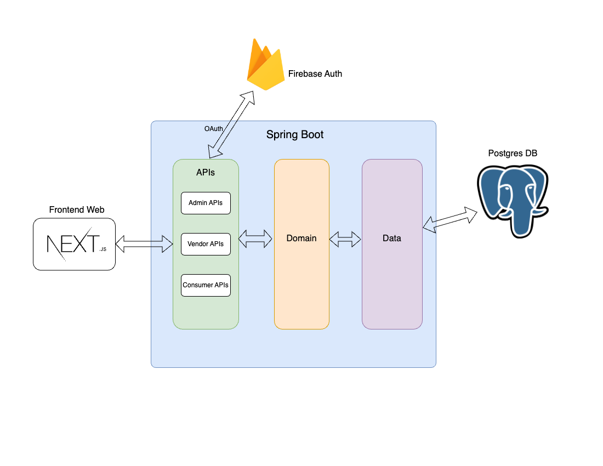

# Multi-vendor marketplace backend

Multi-vendor e-commerce backend application project developed with [Spring boot](https://spring.io/projects/spring-boot/).

The application business story is like Facebook's pages where users can create their shops and sells products but with subscriptions. After users created their shops, administrator need to approved and users need to subscribe one of plans to start selling products.

**Features**:
<ul>
	<li>Banners</li>
	<li>
		Catalog
		<ul>
			<li>Categories (Multi-level support)</li>
			<li>Products (Variations support)</li>
		</ul>
	</li>
	<li>Orders</li>
	<li>Shopping cart</li>
	<li>Favorite products</li>
	<li>Vendors | Shops</li>
	<li>Subscription Plans</li>
	<li>Subscription Promo-codes</li>
	<li>Reviews</li>
	<li>Users</li>
</ul>


**Front-end website repository** => [Multi-vendor marketplace website](https://github.com/phyohtetarkar/marketplace-web/)


## Requirement

<ol>
	<li>Java (<b>Java 17</b> OR <b>Java 21</b> if you want to enable virtual thread)</li>
	<li>PostgreSQL</li>
	<li>2C2P Payment Gateway Credentials</li>
	<li>Firebase auth setup</li>
</ol>

## Setup

**This project use Firebase auth as authentication layer. So, you first need to setup firebase auth and manually create one owner account.**

I use extra YML config files for different active profiles (e.g, dev, staging, prod). Here is example config for `env.development.yml` inside `/marketplace-application/src/main/resources/`

> [!NOTE]
> <b>super-user</b> config is required for owner account initialization.

```yml
app:
  database:
    url: jdbc:postgresql://localhost:5432/marketplace-db
    username: <username>
    password: <password>
  image:
    base-url: (http|https)://<your-domain>/images
    base-path: <image-base-path> # for storing uploaded image (e.g, /var/www/html/images)
  payment:
    merchant-id: <2c2p-merchant-id>
    merchant-sha-key: <2c2p-merchant-sha-key>
    token-request-url: <2c2p-payment-token-request-url>
  firebase:
    api-key: <firebase-api-key>
    jwk-set-uri: https://www.googleapis.com/service_accounts/v1/jwk/securetoken%40system.gserviceaccount.com
    issuer-uri: https://securetoken.google.com/<projectId>
  super-user:
    name: <owner-name>
    email: <owner-email-address> # The one you created from firebase auth
    uid: <firebase-auth-user-uid> # The one you created from firebase auth
  misc:
    website-url: http://localhost:3000 # for payment redirection
    cors-origins: # cors domains for font-end website
      - http://localhost:3000
```

## Build and run

```bash
cd marketplace-backend
./mvnw install && ./mvnw spring-boot:run -pl marketplace-application
```

## Frontend rest apis

This backend produces three main API categories:

<ul>
	<li>Admin APIs</li>
	<li>Vendor APIs</li>
	<li>Consumer APIs</li>
</ul>

You can explore api docs via [OpenAPI 3 UI](https://springdoc.org/) path `http://localhost:8080/api-docs-ui`.

> [!NOTE]
> <b>Payment API</b> is only for 2c2p's server-to-server response so that left out from main API categories.

## Architecture



## Support me

<a href="https://www.buymeacoffee.com/yzox2vc1i">
	
</a>
<br/>
<br/>


## Screenshots


